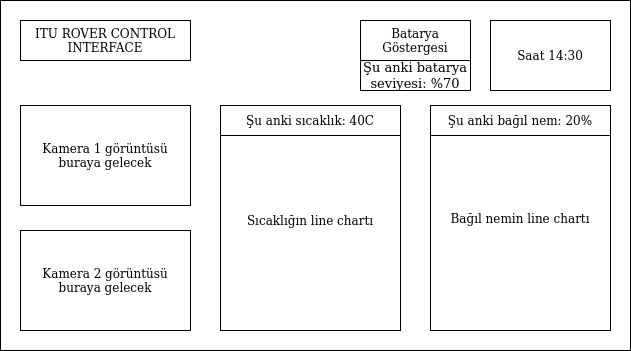
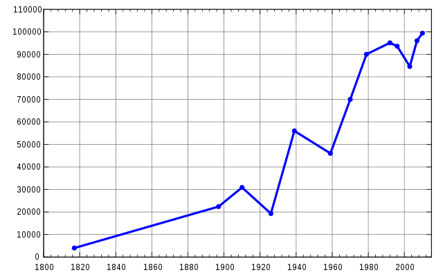
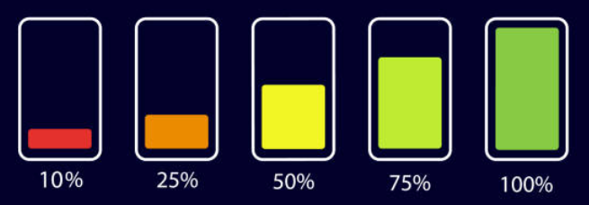

<div align="center">

</div>

# ITU Rover Interface Assignment
Araçtan gelen bazı verilerin kaydını rosbag dosyasının içine kaydettik. Sizden yapmanızı istediğimiz şey ROSLIBjs kullanarak web tabanlı bir arayüzde bu verileri istenilen şekilde görselleştirmeniz.

Ödevle ilgili daha fazla bilgiye ve yardımcı olacak kaynaklara aşağıdan ulaşabilirsiniz.

# Kurulum

Bir workspace oluşturun.

```
mkdir ~/rover_ws
cd ~/rover_ws
catkin_init_workspace
mkdir src
```

Bu paketi klonlayıp derleyin.

```
cd ~/rover_ws/src
git clone https://github.com/itu-rover/iturover_interface_assignment
git clone -b ros1 https://github.com/RobotWebTools/rosbridge_suite
cd ..
catkin build
```

# Kullanım

Rosbag dosyasını çalıştırın.

`
roslaunch iturover_interface_assignment rosbag.launch
`

Yukarıdaki komutu yazdıktan sonra gezintimiz sırasında araçta gerçekleşen veri transferlerinin aynıları bilgisayarınızda da gerçekleşecektir.

Aşağıdaki komutu çalıştırdığınızda veri akışı görüyorsanız rosbag'in doğru bir şekilde çalıştığını anlayabilirsiniz.
`
rostopic echo /rover/interface/time
`

## Rosbag içeriği
Rosbag aşağıdaki topiclerden mesajlar içermektedir:

**/rover/interface/time**

Bu topicte [std_msgs/String](http://docs.ros.org/en/lunar/api/std_msgs/html/msg/String.html) türünde bir veri bulunmaktadır. Paylaşılan veri [Unix Epoch](https://en.wikipedia.org/wiki/Unix_time) zaman gösterimine uygun olarak 1970'ten beri geçen saniye olarak özetlenebilir. Burada görselleştireceğiniz veri bu gösterimin insan tarafından yorumlanabilir hali olacaktır.
`Örneğin; '1670404170.9' verisi Çarşamba, Aralık 7, 2022 12:09:30 PM'e denk gelmektedir. Arayüzde 12:09:30'un görünmesi yeterlidir.`

**/rover/interface/voltage**

Bu topicte [std_msgs/Float32](http://docs.ros.org/en/lunar/api/std_msgs/html/msg/Float32.html) türünde bir veri bulunmaktadır. Paylaşılan veri volt cinsinden ölçülen batarya gerilimini temsil eder. Görselleştirirken [Arayüz İçeriği](#arayüz-içeriği) kısmında gösterildiği gibi batarya seviyesi göstergesinin yanında kalan kapasite yüzde cinsinden gösterilmelidir.

Batarya kapasitesi yaklaşık olarak şu şekilde hesaplanır:

Kalan kapasite (yüzde) = 100 * (Şu anki voltaj - 21.6) / 4.2

`Örneğin; 24.6 V için 100 * (24.6 - 21.6) / 4.2 = 71%`

Bu verinin yayınlanma periyodu 0.05 saniyedir.

**/rover/interface/temperature**

Bu topicte [std_msgs/Float32](http://docs.ros.org/en/lunar/api/std_msgs/html/msg/Float32.html) türünde bir veri bulunmaktadır. Paylaşılan veri santigrat cinsinden ölçülen sıcaklığı temsil eder. Görselleştirirken bu sayının yanına C° yazmanız ve de noktadan sonra tek hane bulunması gereklidir.
`Örneğin; 36.2331 değeri için 36.2 C°`

Bu verinin yayınlanma periyodu 0.5 saniyedir.

**/rover/interface/humidity**

Bu topicte [std_msgs/Float32](http://docs.ros.org/en/lunar/api/std_msgs/html/msg/Float32.html) türünde bir veri bulunmaktadır. Paylaşılan veri yüzde cinsinden ölçülen bağıl nemi temsil eder. Görselleştirirken bu sayının yanına % yazmanız ve de noktadan sonra hane bulunmaması gereklidir.
`Örneğin; 72.4 değeri için 72%`

Bu verinin yayınlanma periyodu 0.2 saniyedir.

**/camera1/usb_cam1/image_raw**
Bu topicte [sensor_msgs/Image Message](http://docs.ros.org/en/noetic/api/sensor_msgs/html/msg/Image.html) türünde bir veri bulunmaktadır. Paylaşılan veri görüntü şeklindedir. Görüntü anlık olarak güncellenmelidir.

**/camera2/usb_cam2/image_raw**
Bu topicte [sensor_msgs/Image Message](http://docs.ros.org/en/noetic/api/sensor_msgs/html/msg/Image.html) türünde bir veri bulunmaktadır. Paylaşılan veri görüntü şeklindedir. Görüntü anlık olarak güncellenmelidir.

## Arayüz içeriği
<div align="center">

</div>

Yukarıdaki şematiğe uygun biçimde istenilen görselleştirmeleri yapmanızı istiyoruz.

<div align="center">

</div>
Sıcaklık ve bağıl nem görselleştirmeleri yukarıdaki gibi bir 'line chart' olarak görselleştirmenizi istiyoruz. Veriler geldikçe grafiğe eklenmelidir ve son 2 saniye içerisinde gelen veriler görüntülenmelidir. Grafik çizdirmek için plotlyjs, chartjs gibi kütüphaneleri kullanabilirsiniz.

<div align="center">

</div>
Batarya yüzdesi yukarıdaki gibi bir kısmi dolu bir pil olarak görselleştirilmelidir.
